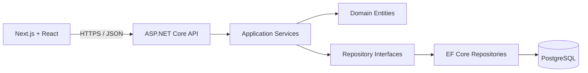
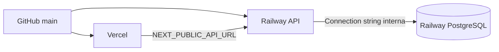

# Arquitectura de SGIP

## Flujo general



## Backend

La API mantiene las dependencias dirigidas hacia el dominio y la aplicación:

- `SGIP.Domain`: modelos y estados del negocio, sin dependencias de infraestructura.
- `SGIP.Application`: reglas de negocio, DTOs, validadores y contratos de repositorio.
- `SGIP.Infrastructure`: persistencia con EF Core, configuraciones, migraciones y datos iniciales.
- `SGIP.Api`: controladores, inyección de dependencias, CORS, Swagger y arranque.

Los servicios `LoanService` y `TransactionService` concentran las reglas y pueden probarse sin levantar HTTP ni PostgreSQL real.

## Frontend

```text
src/
├── app/                  Rutas y layouts de Next.js
├── components/
│   ├── layout/           Estructura visual compartida
│   └── ui/               Componentes reutilizables
├── constants/            Catálogos y opciones de interfaz
├── features/
│   ├── loans/            Componentes, hooks, schemas, servicios, store y tipos
│   └── transactions/     Componentes, hooks, schemas, servicios, store y tipos
├── lib/                  Cliente HTTP y funciones transversales
└── store/                Configuración y hooks tipados de Redux
```

Cada funcionalidad agrupa su interfaz, validación, acceso a datos y estado. `lib` contiene utilidades compartidas que no pertenecen a una sola funcionalidad.

## Persistencia y consistencia

- Las migraciones se ejecutan al iniciar la API.
- Los préstamos, cronogramas y desembolsos comparten el mismo `DbContext`.
- Las claves de idempotencia tienen unicidad en la base de datos.
- La aprobación automática y manual generan un desembolso relacionado al préstamo.

## Despliegue



- Vercel compila únicamente `SGIP.Frontend`.
- Railway construye `SGIP.Api/Dockerfile` desde la raíz del repositorio.
- `CORS_ORIGINS` limita la API al dominio público del frontend y a orígenes locales configurados.
